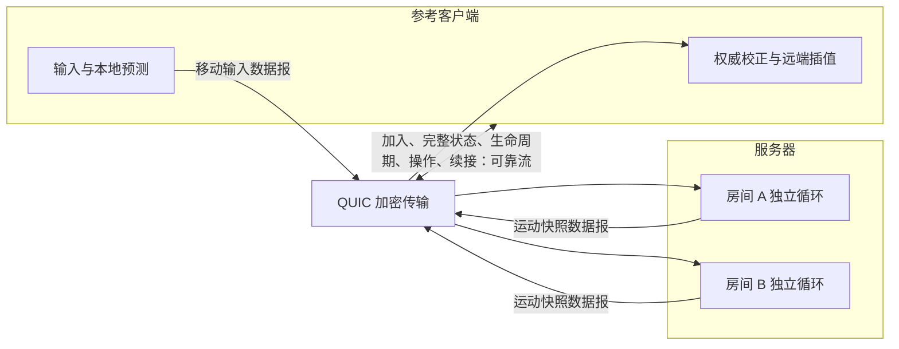

# Go StateSync

**用 Go（编程语言）构建联机游戏的服务器权威状态同步。**

[](https://github.com/qihai-coding/go-statesync/actions/workflows/ci.yml)
[](go.mod)
[](LICENSE)
[](PROTOCOL.md)

[English](README.en.md) · [接入指南](docs/INTEGRATION.md) · [协议](PROTOCOL.md) · [断线续接](RESUME.md) · [开发验收](reports/updates/2026-10-10-weaknet/VALIDATION.md)

面向每房间最多 16 人的合作游戏与实时交互应用。核心库独立于游戏引擎，提供独立服务器、无界面参考客户端、二维移动与拾取示例，以及真实加密连接上的弱网测试。

当前开发版本 **v0.3.0**，使用第 3 版同步协议，尚未发布。已发布的 v0.2.1 使用第 2 版；客户端与服务器需要一起升级，详见[迁移说明](MIGRATION.md)。

## 核心能力

| 能力 | 行为 |
|---|---|
| 多房间权威模拟 | 每个房间独占游戏状态，固定步长推进，网络消息经有界队列投递 |
| 本地预测与校正 | 输入立即预测；收到权威状态后重放尚未确认的输入 |
| 远端快照插值 | 默认缓冲 200 毫秒；缓冲不足时保持最后状态 |
| 进程内断线续接 | 默认保留会话 60 秒；新连接接管原角色，最近操作结果可原样重试 |
| 生命周期与故障隔离 | 可靠同步生成、销毁和拾取；非法批次或可恢复异常只结束受影响房间 |
| 明确的资源边界 | 输入、控制和发送队列均有上限；慢客户端被剔除，旧运动快照可被替换 |
| 无损差量快照 | 引用已确认的可靠不可变基线；不依赖上一包，不能压缩时回退完整记录 |

## 架构



QUIC（基于数据报的加密传输协议）由固定的 SagerNet quic-go（网络传输库）提供；服务器使用内部 BBRv1（瓶颈带宽与往返传播时间第一版）标准控制器，两种编码采用相同传输策略。移动输入和运动快照允许丢失，生命周期、基线确认与离散操作使用可靠流；每条实体运动记录可独立还原和应用。游戏自己定义输入、状态与编码，核心不扫描属性或依赖反射。

默认每秒执行 30 个逻辑步、发送 15 次运动快照，单个数据报不超过 1000 字节。完整配置及边界见[接入指南](docs/INTEGRATION.md#配置)。

## 快速运行

需要 Go（编程语言）1.26 或以上。

```sh
git clone https://github.com/qihai-coding/go-statesync.git
cd go-statesync
go mod download
go run ./cmd/server -generate-cert
go run ./cmd/server -rooms alpha,beta
```

在另外两个终端分别启动客户端：

```sh
go run ./cmd/client -room alpha -x 1 -duration 10s
go run ./cmd/client -room alpha -y 1 -duration 10s
```

演示拾取和断线续接：

```sh
go run ./cmd/client -room beta -pickup 1 -x 1 -duration 8s -disconnect-after 2s
```

本地演示证书有效期为 24 小时，生成命令不覆盖已有证书。重复运行时用 `-cert`、`-key` 和客户端的 `-ca` 指定新文件；客户端始终校验证书。

## 作为库使用

```sh
go get github.com/qihai-coding/go-statesync@v0.2.1
```

实现 `Game`（服务端游戏接口）和 `Model`（客户端预测及编码接口），为每个房间创建独立游戏实例。可先查看[二维示例](arena/arena.go)，再按[接入指南](docs/INTEGRATION.md#接入自己的游戏)替换游戏规则。

上面的安装命令取得已发布的第 2 版；本地第 3 版使用当前工作树。`Config.SnapshotEncoding`（快照编码配置）默认是 `DeltaSnapshots`（差量模式），`FullSnapshots`（完整模式）用于同协议带宽对照。`SampleWithInfo`（带来源信息采样）可读取实际显示状态的来源时间。

业务保存凭证并显式续接，成功后获得新的客户端对象：

```go
token := client.ResumeToken()
client.Disconnect()
next, err := statesync.DialResume(ctx, address, room, tlsConfig, model, token)
if err != nil {
    return err
}
client = next
```

`ResumeToken`（续接凭证）不得写入日志。未确认操作使用原编号、原负载重试；`LastActionID`（最近处理操作编号）包括失败操作，不表示业务成功。完整规则见[续接说明](RESUME.md)。

## 验证与性能

```sh
go test -count=1 ./...
go vet ./...
go test -race -count=1 ./...
go run ./cmd/check -isolate -rooms 8 -clients 16 -duration 10m -resume-every 30s -report soak.json
```

竞态检测需要兼容的 C（编程语言）编译器。[持续集成](https://github.com/qihai-coding/go-statesync/actions/workflows/ci.yml)在三种桌面系统上执行原生测试和构建，另在 Linux（开源操作系统）执行竞态检测与六类模糊测试。

[开发验收](reports/updates/2026-10-10-weaknet/VALIDATION.md)记录当前源码的同协议对照、时效、恢复和资源结果；[首次开发验收](reports/development-v0.3.0/VALIDATION.md)保留此前弱网未达标结果，[v0.2.1 发布验收](reports/release-v0.2.1/VALIDATION.md)保留已发布版本证据。房间单步目标为第 99 百分位低于 10 毫秒。本版分别记录服务器和客户端／代理进程资源，总量不含协调父进程；总应用字节包含双向消息、初始同步和续接。测量方法见[独立性能测量](docs/MEASUREMENT.md)。

本轮固定 16 人、256 个动态实体、32 字节稀疏状态及每秒 30／15 次逻辑／快照频率：普通网络总字节下降 54.79%；150／300 毫秒、种子 7／701 的四组五分钟弱网对照下降 55.70%～56.09%，全部超过 50%。最差逐实体显示年龄第 95 百分位不超过 0.35 秒；解除弱网后全部在 0.29 秒内收敛，未依赖可靠状态纠正。原始字节、计划／提交／接受更新量及资源证据见报告。

## 接入范围

- 每个玩家会话对应一个受控动态实体；本阶段不支持角色重生或控制权切换。
- 续接仅在当前服务器进程内有效，重启后凭证失效；账号认证、持久化、匹配和跨服务器调度由接入应用提供。
- 游戏回调必须快速且不阻塞。异常隔离覆盖可恢复运行时异常，不处理中断进程或无限阻塞。
- 差量收益取决于状态变化量。32 字节稀疏运动负载的收益门槛不能推广到 13 字节演示状态或高熵状态；可见范围筛选尚未加入。

## 文档与贡献

| 文档 | 内容 |
|---|---|
| [接入指南](docs/INTEGRATION.md) | 配置、游戏接口、预测模型、计时与验证口径 |
| [同步协议](PROTOCOL.md) | 字节布局、生命周期、输入确认与固定报文样例 |
| [第 3 版迁移](MIGRATION.md) | 一起升级、配置与来源时间接口 |
| [独立性能测量](docs/MEASUREMENT.md) | 分进程运行、资源字段、收敛采样和证据边界 |
| [断线续接](RESUME.md) | 会话、接管、取消、操作重试与故障处理 |
| [验收报告索引](reports/README.md) | 当前发布与历史验证证据 |
| [更新记录](CHANGELOG.md) | 版本变化与核心加固记录 |
| [贡献指南](CONTRIBUTING.md) | 复现问题、运行检查和提交变更 |

设计参考：[Nakama（游戏后端框架）的房间调度](https://github.com/heroiclabs/nakama/blob/master/server/match_handler.go)、[Mirror（游戏网络同步框架）的插值](https://github.com/MirrorNetworking/Mirror/blob/master/Assets/Mirror/Core/SnapshotInterpolation/SnapshotInterpolation.cs)、[Colyseus（状态同步框架）的编码](https://github.com/colyseus/schema)、[客户端预测与服务器校正](https://www.gabrielgambetta.com/client-side-prediction-server-reconciliation.html)。同步核心独立编写，这些框架不构成运行依赖；内部拥塞控制器移植来源见[来源与适配](internal/bbr/README.md)。

本项目采用 [MIT（宽松开源许可证）](LICENSE)，内部移植代码另保留[原始版权与许可](internal/bbr/README.md)。
